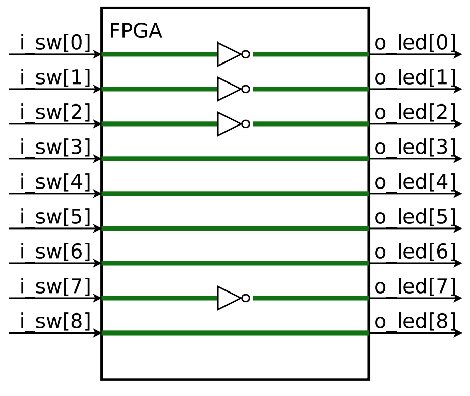
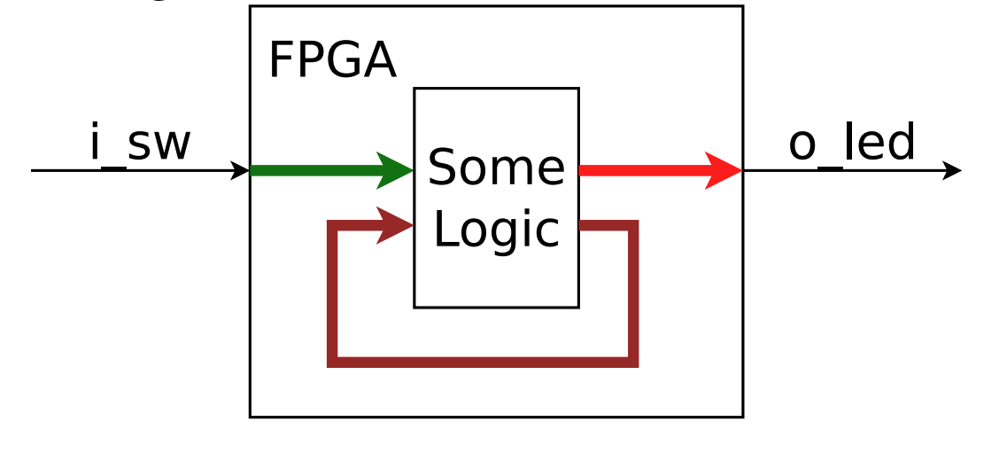

## 1. Wires

One module per file is recommended.

### Schematic

```verilog
module thruwire(i_sw, o_led);
  input		wire 		i_sw;
  output	wire 		o_led;
  assign 	o_led = i_sw;
endmodule
```

```
       +----------------------------+
       | FPGA                       |
       |                            |
       |                            |
       |                            |
  i_sw |                            | o_led
+----->---------------------------------->
       |                            |
       |                            |
       |                            |
       |                            |
       |                            |
       +----------------------------+
```
A very similar design would make a good first serial port test

```
+----------------------+                         +-------------------------+
| CPU                  |                         | FPGA                    |
|                      |                         |                         |
|                      |   uart_cpu_to_fpga      |                         |
|                      +------------------------>---------+                |
|                      |                         |        |                |
|                      |                         |        |                |
|                      |                         |        |                |
|                      |                         |        |                |
|                      |    uart_fpga_to_cpu     |        |                |
|                      <--------------------------<-------+                |
|                      |                         |                         |
|                      |                         |                         |
|                      |                         |                         |
+----------------------+                         +-------------------------+

```

```
                           +------------------------------------------------------------------------------------+
                           |                 FPGA Development Board                                             |
                           |                                                                                    |
+--------------------+     |    +----------------------+                         +-------------------------+    |
|                    |     |    | FTDI                 |                         | FPGA                    |    |
| CPU                |     |    | FT2232               |                         |                         |    |
|                    |     |    |                      |   uart_cpu_to_fpga      |                         |    |
|                    |     |    |                      +------------------------>---------+                |    |
|                    |     |    |                      |                         |        |                |    |
|                    |USB  |    |                      |                         |        |                |    |
|                    +----->    |                      |                         |        |                |    |
|                    <-----+    |                      |                         |        |                |    |
|                    |     |    |                      |    uart_fpga_to_cpu     |        |                |    |
|                    |     |    |                      <--------------------------<-------+                |    |
|                    |     |    |                      |                         |                         |    |
|                    |     |    |                      |        JTAG             |                         |    |
|                    |     |    |                      +------------------------->                         |    |
+--------------------+     |    +----------------------+                         +-------------------------+    |
                           |                                                                                    |
                           |                                                                                    |
                           +------------------------------------------------------------------------------------+

```

FTDI FT2232H provides access to both

- UART (i.e. serial port), and
- JTAG, to load your design into FPGA in the first place

Other solutions exits, such as

- A STM chip, as used by Blacklce, or
- Direct USB, as used by the TinyFPGA BX

### Constraint File: maps your ports to the pins.

- PCF: Arachne-PNR and NextPNR
- UCF: ISE
- XDC: Vivado
- QSF: Quartus

#### PCF File:

```pcf
set_io 	i_sw 	P13
set_io	o_led	C8
```

Maps top-level ports to pins

#### UCF File

```
NET "i_sw"	LOC	=	"P9" | IOSTANDARD	=	LVCMOS33
NET "o_led"	LOC	=	"N3" | IOSTANDARD	=	LVCMOS33
```

Most development boards use the 3.3V LVCMOS standard

- Pins are typically grouped in banks
- All pins in a bank use the same voltage
- This voltage is usually fixed
- The master constraint file will help here

#### XDC File

```
set_property -dict {PACKAGE_PIN E22 IOSTANDARD LVCMOS12}	[get_ports {i_sw}]
set_property -dict {PACKAGE_PIN T14 IOSTANDARD LVCMOS25}	[get_ports {o_led}]
```

Usually, the vendor will provide a "master XDC" file.

### Build the design

### Simulation

| Simulation             | Hardware                  |
| ---------------------- | ------------------------- |
| Can trace all signals  | Can only see some signals |
| Extended tests cost GB | Extended tests are simple |
| Easy to debug          | Very hard to debug        |

#### Verilator

```
verilator -Wall -cc thruwire.v
cd obj_dir/
make -f Vthruwire.mk
```

- Verilator compiles Verilog into C++ placed into obj_dir/
- The make command then builds this converted C++ file into a share object file we can now use

### Verilator Driver

```c++
// thruwire.cpp
#include <stdio.h>
#include <stdlib.h>
#include "Vthruwire.h"
#include "verilated.h"
int main(int argc, char **argv) {
  // Call commandArgs first!
  Verilated::commandArgs(argc, argv);
  //Instantiate our design
  Vthruwire *tb = new Vthruwire;
  // Now run the design thru 20 timesteps
  for (int k = 0; k < 20; k++) {
    // We'll set the switch input
    // to the LSB of our step
    tb->i_sw = k & 1;
    tb-eval();
    // Now let's print our results
    printf("k = %2d, ", k);
    printf("sw = %d, ", tb->i_sw);
    printf("led = %d\n", tb->o_led);
  }
}
```

#### Building it all

Let's put it all together:

```
% g++ -I /usr/share/verilator/include -I obj_dir/ /usr/share/verialtor/include/verilated.cpp thruwire.cpp obj_dir/Vthruwire__ALL.a -o thruwire
```

```
% cd examples/ex-01-thruwire
% make
```

We can now run our simulator.

```
% thruwire
k	=	0,	sw	=	0,	led	=	0
k	=	1,	sw	=	1,	led	=	1
k	=	2,	sw	=	0,	led	=	0
k	=	3,	sw	=	1,	led	=	1
k	=	4,	sw	=	0,	led	=	0
...
```

#### Good habits

1. Make `'default_nettype` none the first line of your Verilog file.
   - Before your `module` declartion	
   - Otherwise mis-spelled indentifiers will be quietly turned into wires
2. Fix any errors when you `verilator -Wall` your design
3. Run your design in a simulator
   - Attempt to recreate any hardware bugs...in the simulator

### Bus Signals

```verilog
input		wire	[8:0] i_sw
output	wire	[8:0]	o_led;
```

### Bit Select

```verilog
assign	o_led[7]	=	i_sw[0];
assign	o_led[6:5]	=	i_sw[5:4];
assign	o_led[4:0]	=	{	i_sw[2:0],	i_sw[7:6]	};
```

### Internal Signal

```verilog
wire	[8:0]	w_internal;
assign	w_internal = 9'h87;
assign	o_led	=	i_sw	^	w_internal;
```

Internal wires are neither input nor output

A Verilog literal is defined as

- An width
- An apostrophe
- An optional sign indication, s. Defualts to unsigned
- A numeric type: h(hex),d(deciaml),o(octal),b(binary),sd(signed deciaml)
- The value: a series of digits, possibly containing underscores. Underscores can be very useful for longer numbers

Place a '-' in front of the width for negative numbers. e.g. -7'sd124

If the literal is smaller than the context...

- If there is no 's', the number is unsigned and it is zero extended
- Any literal with an 's' is sign extended

If the literal is too big for the context

- It is truncated to fit the context

#### Operators

Limited, use with care: `*` Multiplication

Avoid within logic: `/`Division,`%` Remainder

Some FPGA's support native multiplication.

None support a single clock divide or remainder.

### Schematic

```verilog
assign	w_internal = 9'h87;
assign	o_led	=	i_sw	^	w_internal;
```

Get the internal structure from the code:



### Circular Logic

Avoid circular logic!

```verilog
assign	o_led	=	i_sw	+	o_led;
```

This doesn't word in hardware like it might in software

This is roughlt equivalent to creating a short circuit

Most tools will fail to build such designs



#### Dual Assignment

A value can only be set once

This is an error:

```verilog
assign	o_led	=	i_sw	|	9'h87;
assign	o_led	=	i_sw	+	1;
```

### Build the design

```verilog
'default_nettype	none

module maskbus(i_sw, o_led);
	input		wire 	[8:0]	i_sw;
	output	wire 	[8:0]	o_led;
	wire [ 8 : 0 ] w_internal ;
	assign	w_internal	= 9’h87;
	assign 	o_led				= i_sw ˆ w_internal;
endmodule
```

```cpp
int main(int argc, char **argv) {
  // Call commandArgs first!
  Verilated::commandArgs(argc, argv);
  //Instantiate our design
  Vthruwire *tb = new Maskbus;
  // Now run the design thru 20 timesteps
  for (int k = 0; k < 20; k++) {
    // Bottom 9 bits of counter
    tb->i_sw = k & 0x1ff;
    tb-eval();
    // Now let's print our results
    printf("k = %2d, ", k);
    printf("sw = %3x, ", tb->i_sw);
    printf("led = %3x\n", tb->o_led);
  }
}
```

```
% ./maskbus
k	=	0,	sw	=	0,	led	=	87
k	=	1,	sw	=	1,	led	=	86
k	=	2,	sw	=	2,	led	=	85
k	=	3,	sw	=	3,	led	=	84
k	=	4,	sw	=	4,	led	=	83
...
```

